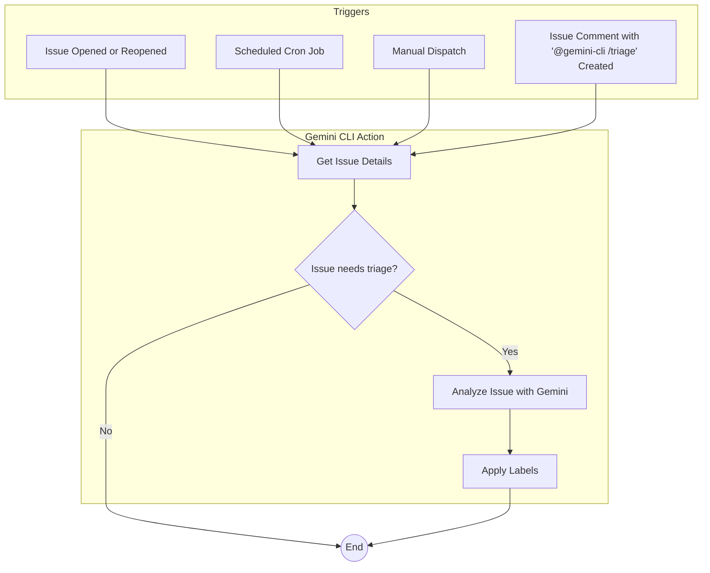

# Issue Triage Workflows

This document describes a comprehensive system for triaging GitHub issues using the Gemini CLI GitHub Action. This system consists of two complementary workflows: a real-time triage workflow and a scheduled triage workflow.

## How it Works

